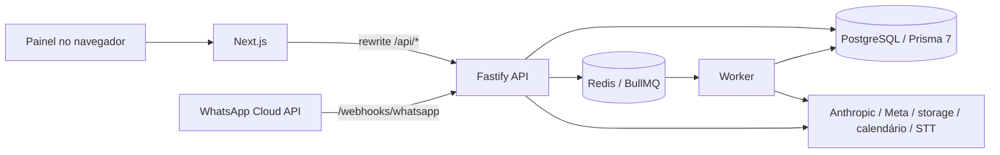

# Arquitetura

Estado documentado: código do MVP em 2026-09-27. O sistema é um monólito modular multiempresa: um PostgreSQL, um schema e escopo por `companyId`. As decisões históricas estão em [DECISIONS.md](../DECISIONS.md); este guia descreve a implementação existente.

## Processos e dependências

API e worker compartilham módulos e providers, mas são processos separados. O painel não acessa o banco diretamente.

| Área                    | Responsabilidade e entrada                                                                                                                           |
| ----------------------- | ---------------------------------------------------------------------------------------------------------------------------------------------------- |
| `apps/api`              | HTTP em [main.ts](../apps/api/src/main.ts), montagem das rotas em [app.ts](../apps/api/src/app.ts), filas em [worker.ts](../apps/api/src/worker.ts). |
| `apps/web`              | Next.js App Router, React, TanStack Query e UI em pt-BR. O [rewrite](../apps/web/next.config.ts) usa `API_INTERNAL_URL` para encaminhar `/api/*`.    |
| `packages/config`       | [Validação do ambiente](../packages/config/src/env.ts), incluindo bloqueios de produção.                                                             |
| `packages/shared`       | Enums, erros, horários e [permissões](../packages/shared/src/permissions.ts).                                                                        |
| `packages/database`     | [Schema](../packages/database/prisma/schema.prisma), migrações, Prisma 7 com adapter `pg`, escopo por empresa e senhas.                              |
| `packages/ai`           | Contrato de provider, engine, prompts, templates e cálculo do buffer.                                                                                |
| `packages/whatsapp`     | Provider Cloud/mock, normalização de eventos, assinatura e janela de atendimento.                                                                    |
| `packages/integrations` | Contratos e implementações de storage, calendário e transcrição.                                                                                     |

O [container](../apps/api/src/container.ts) reúne `Env`, logger, `JobQueue`, `SecretBox`, providers e Redis. O [bootstrap](../apps/api/src/bootstrap.ts) real usa Redis/BullMQ; testes podem injetar implementações em memória. Os pacotes internos exportam TypeScript; API e worker são empacotados com esbuild, mantendo dependências npm externas (D-016).

## Interfaces HTTP e domínio

| Prefixo na API                      | Uso                                                                                                                                                       |
| ----------------------------------- | --------------------------------------------------------------------------------------------------------------------------------------------------------- |
| `/api/public`                       | Sem sessão: planos à venda, status do sistema e OpenAPI da API v1.                                                                                        |
| `/api/auth`                         | Login, logout, sessão atual, troca de empresa e senha; cadastro, confirmação de e-mail, recuperação de senha, aceite de convite e sessões ativas.         |
| `/api/v1`                           | API pública por chave (`Bearer wz_...`), versionada; contatos, conversas e envio de mensagens (D-041).                                                    |
| `/api/app`                          | Painel empresarial: contatos, conversas, CRM, catálogo, agenda, agente, conhecimento, automações, equipe, integrações, métricas, auditoria e exportações. |
| `/api/platform`                     | Empresas, planos, preços, limites, administradores, saúde e modo suporte.                                                                                 |
| `/api/integrations/google/callback` | Retorno OAuth autenticado do Google.                                                                                                                      |
| `/webhooks/whatsapp`                | Verificação GET e eventos POST com assinatura.                                                                                                            |
| `/webhooks/stripe`                  | Eventos de cobrança assinados; gravados de forma idempotente e processados pela fila (D-039).                                                             |
| `/health`, `/health/ready`          | Liveness do HTTP; readiness consulta PostgreSQL e Redis.                                                                                                  |

O [registro empresarial](../apps/api/src/modules/company/routes.ts) lista os subprefixos. Rotas usam Zod e guards; serviços recebem [CompanyScope](../apps/api/src/context.ts), com client de banco, ator, permissões e infraestrutura. A empresa do painel vem da sessão; veja [MULTITENANCY.md](MULTITENANCY.md).

## Fluxo de atendimento

1. O webhook valida HMAC do corpo bruto, normaliza o evento e resolve a empresa pelo `WhatsAppAccount.phoneNumberId` persistido.
2. [recordWebhookEvent](../apps/api/src/modules/webhooks/service.ts) grava `WebhookEvent`, com unicidade `(provider, dedupeKey)`, e enfileira `webhook.process`.
3. O worker relê o evento. A [ingestão](../apps/api/src/modules/messaging/inbound.ts) cria/atualiza contato e conversa, persiste a mensagem, atualiza a última entrada e agenda mídia/agente conforme necessário. `Message` possui unicidade `(companyId, externalId)`.
4. `agent.reply` agrupa entradas ainda não tratadas após o buffer. O [runner](../apps/api/src/modules/agent/runner.ts) relê estado, configuração, limites e modo da conversa; monta contexto, executa IA/tools e registra execução/consumo.
5. A saída segue por `message.send`; o [serviço de envio](../apps/api/src/modules/messaging/outbound.ts) aplica as regras do canal. Webhooks posteriores atualizam entrega/leitura/falha.
6. Eventos de domínio alimentam automações; resumos, documentos, calendário, lembretes e retenção têm jobs próprios. O handoff e o modo humano são estados persistidos da conversa.

A busca de conhecimento usa [SQL parametrizado com filtro explícito de empresa](../apps/api/src/modules/knowledge/retriever.ts): full-text em português e fallback por similaridade de título. Não há embeddings neste MVP.

## Filas, concorrência e recuperação

O [catálogo tipado](../apps/api/src/queues/types.ts) define os jobs: `webhook.process`, `agent.reply`, `message.send`, `media.process`, `conversation.summarize`, `domain-event.dispatch`, `knowledge.process-document`, `calendar.sync`, `appointments.reminders`, `maintenance.retention`, `agent.recover-stalled`, `usage.alerts` (avisos 70/90/100%), `email.send`, `billing.event` (webhooks da Stripe) e `webhook.deliver` (webhooks de saída). Payloads carregam IDs e parâmetros de controle, e os processadores reconsultam o banco.

Cada job tem fila própria; o nome troca pontos por hífens, sob prefixo `botsaas`. [BullJobQueue](../apps/api/src/queues/bullmq.ts) aplica tentativas limitadas e backoff exponencial; mantém jobs concluídos por até 24h/1.000 registros e falhos por até sete dias/5.000 registros. O worker registra falhas finais em `ErrorLog`. Concorrência por fila está em [processors.ts](../apps/api/src/jobs/processors.ts).

O worker agenda lembretes a cada 15 minutos e retenção com cron `0 30 3 * * *` (sem timezone explícito no código). Publica heartbeat no Redis a cada 15 segundos, com TTL de 120 segundos. Readiness da API não comprova saúde do worker nem disponibilidade dos providers externos.

Limites reais:

- **D-007 evoluiu em D-021:** a [lease Redis](../apps/api/src/lib/locks.ts) usa TTL de 180 segundos, renovação a cada 60 segundos e liberação por token; em testes sem Redis usa memória local. Conexão dedicada e prazos limitados detectam perda de posse, bloqueando efeitos posteriores do runner. Não há fencing com PostgreSQL nem cancelamento de trabalho já em voo; uma troca silenciosa do token só é detectada na renovação.
- A entrada grava contato, conversa, mensagem, mídia, métricas, lead e outbox numa transação serializável com escopo de empresa. O enqueue fica depois do commit; reentrega/retry reconstrói jobs pendentes sem repetir os efeitos no banco. Webhooks `RECEIVED`/`PROCESSING` reenfileiram com ID estável. Jobs falhos esgotados não são reabertos. Para respostas da IA há recuperação: o job `agent.recover-stalled` (a cada 5 min) reagenda conversas com mensagem do cliente pendente entre 10 min e 6 h e passa para humano depois de 3 execuções sem resolver (D-032). Não há reconciliador para outros jobs nem backfill de dados parcialmente gravados por versões anteriores.
- Retentativas e chaves de deduplicação não constituem garantia de execução exatamente uma vez em providers externos.
- **D-008 diverge do código:** `AI_PROVIDER=mock`, `WHATSAPP_PROVIDER=mock` e `STT_PROVIDER=mock` são proibidos em produção, sem flag de exceção. `STORAGE_PROVIDER=local` também impede a inicialização em produção, embora a mensagem de erro o descreva como não recomendado.

## Verificação e evolução

[VALIDATION.md](VALIDATION.md) descreve os checks e a infraestrutura de testes. As suítes locais com providers simulados verificam fluxos internos; não homologam Meta, Anthropic, Google ou S3. Novos módulos empresariais devem preservar `CompanyScope`, RBAC por permissão, validação de relacionamentos e jobs tolerantes a reexecução. Controles e limites operacionais estão em [SECURITY.md](SECURITY.md).
